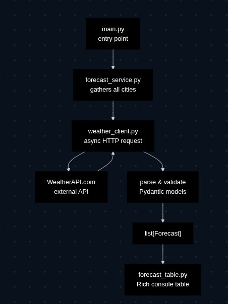
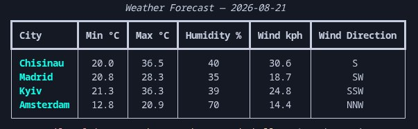

# Weather Forecast CLI

A production-ready, asynchronous Python Command Line Interface (CLI) application built to efficiently fetch, process, and display tomorrow's weather forecasts and related metrics for a configured list of target cities using the WeatherAPI service.

---

## Application Architecture



The application is engineered around a strict, unidirectional architectural workflow based on the Separation of Concerns principle. The system is split into independent layers, ensuring high maintainability and solid data boundaries:

* **main.py (Orchestration)**: Serves as the central entry point and application lifecycle controller. It leverages `pydantic-settings` to load and validate environment configurations, bootstraps the asynchronous event loop, and coordinates the execution flow.
* **forecast_service.py (Application Logic)**: Orchestrates the core business rules. It receives the list of target locations, coordinates concurrent tasks, and delegates the raw data fetching and layout generation to their respective modules.
* **weather_client.py (External API Communication)**: Encapsulates all raw network interactions. It constructs endpoints, injects authentication headers, handles HTTP handshakes asynchronously using `httpx`, and yields control during network wait times to achieve maximum I/O efficiency.
* **Forecast (Validated Data Boundary)**: Defines the internal contract of the application. Raw JSON payloads from WeatherAPI are immediately parsed and filtered by Pydantic models. This isolates downstream code from external API changes and guarantees runtime type safety.
* **forecast_table.py (Presentation Layer)**: Purely responsible for data visualization. It takes sanitized internal models and designs the final terminal layout matrix using the `rich` library.

---

## Key Features

* **Asynchronous Concurrency**: Requests weather data for all configured locations simultaneously via `asyncio.gather()`, drastically reducing execution time compared to sequential polling.
* **Strict Data Isolation**: Enforces a robust data boundary by translating external API responses into a validated internal data structure before rendering.
* **Structured Visual Reporting**: Formats the finalized data into a clean, human-readable terminal matrix with auto-aligned columns and distinct border framing.

---

## Core Metrics Collected

For every configured location, the application parses and aggregates the following metrics for the next calendar day:
* **Min °C**: The minimum predicted temperature.
* **Max °C**: The maximum predicted temperature.
* **Humidity %**: The average relative humidity percentage across the day.
* **Wind kph**: The maximum wind speed recorded in kilometers per hour.
* **Wind Direction**: The specific wind direction vector at 12:00 PM.

## Quick Start Guide

### 1. Environment Initialization
This application requires Python 3.14 or higher due to modern runtime and typing specifications.

#### On Linux / macOS:
```bash
# Clone the repository
git clone https://github.com/GilevIlya/WeatherAPICodeChallenge.git
cd WeatherAPICodeChallenge

# Initialize and activate the isolated virtual environment
python -m venv .venv
source .venv/bin/activate

# Install required dependencies
pip install -r requirements.txt
```

#### On Windows:
```cmd
:: Clone the repository
git clone https://github.com/GilevIlya/WeatherAPICodeChallenge.git
cd WeatherAPICodeChallenge

:: Initialize the virtual environment
python -m venv .venv

:: Activate the virtual environment (Command Prompt)
.venv\Scripts\activate.bat

:: OR Activate the virtual environment (PowerShell)
:: .venv\Scripts\Activate.ps1

:: Install required dependencies
pip install -r requirements.txt
```

### 2. Configuration Setup
Runtime values are decoupled from the source code and managed via environment variables. Generate your local configuration file from the provided template:

#### On Linux / macOS:
```bash
cp .env.example .env
```

#### On Windows (Command Prompt):
```cmd
copy .env.example .env
```

#### On Windows (PowerShell):
```powershell
Copy-Item .env.example .env
```

Open the newly created `.env` file and input your personal WeatherAPI credentials along with your target cities formatted as a valid JSON array:

```env
WEATHER_API_KEY=Enter your WeatherAPI api key here
CITIES=["Chisinau","Madrid","Kyiv","Amsterdam"]
```

### 3. Execution
Run the orchestration script to initiate concurrent polling and display the results:

```bash
python main.py
```
---

## Example Output



---

---

## Directory Tree

```text
.
├── app/
│   ├── api/          # Network communication layer (weather_client.py)
│   ├── display/      # Presentation components and layout design (forecast_table.py)
│   ├── models/       # Data validation boundaries and schemas (Forecast)
│   └── services/     # Core application logic and workflow orchestration (forecast_service.py)
├── config.py         # Type-safe environment loading and validation
├── main.py           # Application entry point and async lifecycle manager
├── .env.example      # Template for localized environment variables
├── pyproject.toml    # Project metadata and tooling configurations
└── requirements.txt  # Explicit pinned third-party dependencies
```

---

## Technical Stack and Dependencies

The project relies on a minimal footprint of industry-standard libraries, selected specifically to maximize asynchronous performance and type safety.

| Package | Classification | Technical Purpose in Project |
| :--- | :--- | :--- |
| **Python 3.14+** | Runtime | Core language. |
| **httpx** | Network I/O | Provides the underlying `AsyncClient` infrastructure needed for non-blocking HTTP requests and connection pooling. |
| **pydantic** | Data Integrity | Enforces runtime type-hinting, sanitizes inbound JSON payloads, and handles data parsing exceptions. |
| **pydantic-settings** | Configuration | Automatically parses, casts, and validates environment variables from `.env` files into type-safe Python objects. |
| **rich** | Terminal UI | Handles advanced console text styling, grid auto-scaling, and ANSI escape sequences for rendering clean terminal tables. |
